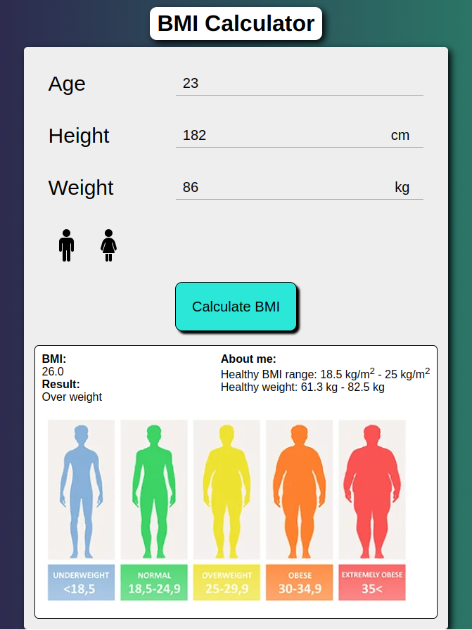

# BMI-Calculator

The BMI Calculator I’ve developed is a web application that allows users to calculate their Body Mass Index (BMI). The BMI is a measure of body fat based on a person’s height and weight.

When the user inputs their age, height, weight, and sex, the application calculates their BMI and determines their weight category (e.g., “Underweight”, “Normal”, “Overweight”, “Obese”, “Extremely Obese”). Additionally, the application provides the healthy weight range for the user’s height.

In summary, this project combines web technologies (HTML, CSS, and JavaScript) to create a functional and user-friendly BMI calculator.⚕️❤️

And this is the result 

- This is what it looks like on a PC with a resolution of 1920x1080:

 

- This is what it looks like on an iPhone SE with a resoution of 375x667:

- This is what it looks like with the result:

